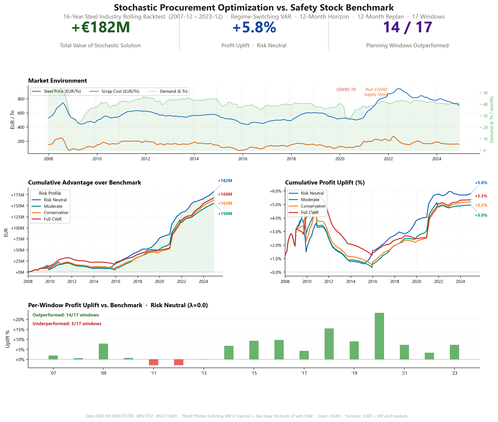

<div align="center">

# Steel Industry Stochastic Procurement Optimization

**Scenario-driven procurement and capacity planning for steel manufacturing — find the optimal balance between commitment and flexibility under genuine market uncertainty.**

[](https://www.python.org/downloads/) &ensp; [](LICENSE) &ensp; [](https://highs.dev/)

</div>

---

## 🎯 The Problem

Steel manufacturers commit to production capacity and raw material contracts **months before knowing what demand, prices, or costs will be**. Traditional ERP planning relies on point forecasts and safety stock buffers — ignoring correlations, failing to quantify risk, and leaving money on the table in every market regime.

This framework replaces that with a **scenario-aware optimizer** that evaluates thousands of plausible futures and finds the plan that maximizes expected profit while explicitly protecting against downside risk.

---

## ❓ What Questions It Answers

> ###### *"How much base capacity should I commit to — and when should I use overtime?"*
> <sub>Optimal monthly split between base capacity and flexible production (overtime, subcontracting) across thousands of demand scenarios.</sub>

> ###### *"How should I balance fixed contracts, option call-offs, and spot purchases?"*
> <sub>Cost-optimal allocation across all three procurement instruments — committed volume, reserved-but-optional volume, and market-rate fallback — for the current price environment.</sub>

> ###### *"What is the real cost of playing it safe?"*
> <sub>Quantified profit–risk trade-off: see exactly how much expected profit you give up for each increment of downside protection.</sub>

> ###### *"How would this plan have held up in 2008… or COVID… or the 2022 price spike?"*
> <sub>Rolling backtest across 17 windows spanning 16 years — every crisis, every recovery, every supply shock from 2007 to 2023.</sub>

> ###### *"What if scrap spikes 30% and demand drops 20% at the same time?"*
> <sub>Analyst-defined stress scenarios are injected directly into the optimization — the plan is guaranteed to have seen them.</sub>

> ###### *"Is this actually better than what we do today?"*
> <sub>Measured head-to-head: the Value of Stochastic Solution (VSS) quantifies the profit improvement over traditional safety-stock planning in every regime tested.</sub>

---

## ⚙️ How It Works

```mermaid
graph LR
    A["📊 <b>FRED Market Data</b><br/>20+ years of steel prices,<br/>scrap costs & demand"] --> B["🔧 <b>DataLoader</b><br/>Clean, align,<br/>log-returns"]
    B --> C["📈 <b>Regime-Switching VAR</b><br/>Fit normal + stress<br/>regime dynamics"]
    C --> D["🎲 <b>Scenario Generation</b><br/>3 000 correlated<br/>forward paths"]
    D --> E["✂️ <b>Scenario Reduction</b><br/>K-medoids → 300<br/>+ stress tails"]
    E --> F["⚙️ <b>Stochastic Optimizer</b><br/>Two-stage program<br/>with CVaR"]
    F --> G["📋 <b>Optimal Plan</b><br/>Capacity, contracts,<br/>risk metrics"]

    style A fill:#4472C4,stroke:#2F5597,color:#fff
    style B fill:#5B9BD5,stroke:#4472C4,color:#fff
    style C fill:#70AD47,stroke:#548235,color:#fff
    style D fill:#70AD47,stroke:#548235,color:#fff
    style E fill:#FFC000,stroke:#BF9000,color:#000
    style F fill:#ED7D31,stroke:#C55A11,color:#fff
    style G fill:#7030A0,stroke:#4E2074,color:#fff
```



**Stage 1 (commit now):** Base production capacity · Fixed procurement contracts · Framework option reservations  
**Stage 2 (adapt later):** Framework exercise · Spot purchases · Flex production · Inventory management

---

## 📊 Results at a Glance

Backtested across 17 rolling windows from 2007 to 2023 — including the GFC crash, Euro debt crisis, COVID-19 demand shock, and post-COVID supply spike:



| Metric | Stochastic Optimizer | Safety Stock Benchmark |
|--------|:-------------------:|:---------------------:|
| Total profit (16-year backtest) | **+€182M above benchmark** | Baseline (€3,135M) |
| Profit uplift | **+5.8%** (Risk Neutral, λ=0.0) | — |
| Planning windows outperformed | **14 / 17** (82%, Risk Neutral) | — |
| Fill rate | ≥ 97% | 85–95% |
| Worst-case profit (CVaR 5%) | Materially better | Fragile in crises |
| Shortage events | Near-zero | Common in volatile periods |

**Risk profile comparison** (all vs. Safety Stock benchmark):

| Profile | λ | VSS | Uplift | Windows won |
|---------|---|-----|--------|-------------|
| Risk Neutral | 0.0 | +€182M | +5.8% | 14/17 |
| Moderate | 0.3 | +€156M | +5.0% | 13/17 |
| Conservative | 0.7 | +€163M | +5.2% | 13/17 |
| Full CVaR | 1.0 | +€168M | +5.3% | 12/17 |

> Risk Neutral wins both the most windows (14/17) and the highest total profit in this backtest — expected-profit maximization dominates when the scenario model captures regime structure well. Higher λ profiles trade some total upside for reduced tail exposure; Full CVaR wins fewer windows but outperforms by larger margins during volatile regimes (2008, COVID, post-COVID spike). The λ parameter is a strategic choice, not a calibration: the right answer depends on your market view and balance sheet tolerance for tail risk.

---

## 🔧 Key Features

<table>
<tr>
<td width="50%">

**Risk-Aversion Control**

A single parameter shifts the objective from pure expected-profit maximization to explicit downside protection:

 &nbsp;
<sub>Maximize expected profit, no tail-risk penalty</sub>

 &nbsp;
<sub>Hedge against worst outcomes while preserving upside</sub>

 &nbsp;
<sub>Prioritize protecting worst-case profit via CVaR</sub>

</td>
<td width="50%">

**Stress Testing**

Inject analyst-defined extreme scenarios directly into the optimization so the plan is *guaranteed* to have seen them:

> *"What if selling prices drop to the 5th percentile while scrap costs spike to the 95th?"*

Covers price collapses, cost spikes, demand crashes — and any combination of the three.

</td>
</tr>
<tr>
<td>

**Three Contract Instruments**

- **Fixed contracts** — committed volume at known price
- **Framework call-offs** — right but not obligation, bounded exercise price
- **Spot purchases** — unlimited, market-rate fallback

</td>
<td>

**16-Year Rolling Backtest**

17 autonomous replanning windows across real market history:

> *GFC Crash · Euro Debt Crisis · Post-GFC Stagnation · Recovery · COVID-19 · Post-COVID Supply Spike*

Every regime tests a different failure mode for traditional planning.

</td>
</tr>
</table>

---

## 👤 Who Is This For

- **Supply chain leaders** evaluating optimization-based planning vs. traditional ERP/MRP approaches
- **Procurement managers** looking to quantify the value of contract flexibility under price uncertainty
- **Operations research practitioners** seeking a production-ready two-stage stochastic programming implementation with real data
- **Data scientists & quants** interested in VAR-based scenario generation with stress testing for commodity markets

---

## 🚀 Quick Start

```bash
pip install -r requirements.txt
```

```python
from src.data.loader import DataLoader
from src.scenario.regime_switching import RegimeSwitchingGenerator
from src.optimization.stochastic import StochasticOptimizationModel, ModelParameters
from src.params.risk import RiskProfile

# 1. Load 15 years of FRED market data
loader = DataLoader(fred_api_key="your_key")
loader.load_from_fred().subset(180, last_observation="2019-12-01")
loader.convert_to_real_prices("2019-12-01", {"P": 520, "C": 130, "D": 50000})
loader.compute_log_returns()

# 2. Fit Regime-Switching VAR → generate 3,000 scenarios → reduce to 300
gen = RegimeSwitchingGenerator(n_regimes=2)  # normal + stress regimes
gen.fit(loader)
print(gen.regime_summary())                  # inspect regime structure
reduced = gen.reduce(gen.generate(n_scenarios=3000, horizon=12), n_clusters=300)

# 3. Solve
result = StochasticOptimizationModel().run(
    reduced.scenarios, reduced.probabilities,
    params=ModelParameters(c_fix=320, x_fix_max=8000, x_opt_max=4000, alpha=1.2, pen_short=500),
    risk_profile=RiskProfile(risk_aversion=0.3),
    variable_mapping={"C": "c_spot", "P": "p_sell"},
)

print(f"E[Profit]  EUR {result.risk_metrics['Expected_Profit']:>12,.0f}")
print(f"CVaR (5%)  EUR {result.risk_metrics['CVaR_95']:>12,.0f}")
print(f"Sharpe         {result.risk_metrics['Sharpe']:>12.3f}")
```

<details>
<summary><b>Installation notes</b></summary>

- A free [FRED API key](https://fred.stlouisfed.org/docs/api/api_key.html) is required for data loading.
- **Windows**: `scikit-learn-extra` (K-medoids) needs C++ build tools — install [Microsoft C++ Build Tools](https://visualstudio.microsoft.com/visual-cpp-build-tools/) or `conda install -c conda-forge scikit-learn-extra`.

</details>

---

## ⚠️ Limitations

- **Two stages, not rolling** — Stage 2 assumes full uncertainty resolution at once. Real planning involves continuous rebalancing with partial information. Multi-stage extensions would improve realism at significant computational cost.
- **Single product** — The current model handles one aggregate steel product. Multi-product extensions (e.g., flat vs. long products) are not yet supported.
- **No supply disruption modeling** — Scenarios capture price and demand uncertainty but not discrete supply chain disruptions (plant outages, port closures, trade sanctions).
- **Solver dependency** — Requires a linear programming solver. HiGHS (open-source, default) is sufficient; commercial solvers (Gurobi, CPLEX) are supported but not required.
- **Monthly granularity only** — the data pipeline, scenario generator, and optimization model all operate at monthly frequency. Sub-monthly or weekly planning horizons would require a redesigned data layer.

---

## 📖 Documentation

| Document | Contents |
|----------|----------|
| [Problem Formulation](docs/problem_formulation.md) | Business context, contract types, production structure, why two-stage |
| [Mathematical Formulation](docs/math_formulation.md) | VAR model, scenario generation, stochastic program, CVaR, benchmark math |
| [Package Documentation](docs/package_documentation.md) | Full API reference with usage examples for every class and method |

---

## 📊 Data Sources

All inputs are public data from the [Federal Reserve Economic Data (FRED)](https://fred.stlouisfed.org/) API:

| Variable | Series | Description |
|----------|--------|-------------|
| Steel price | `WPU101704` | PPI: Hot Rolled Bars, Plates & Structural Shapes |
| Scrap cost | `WPU1012` | PPI: Iron and Steel Scrap |
| Demand | `IPG3311A2S` | Industrial Production: Steel Products |

---

<div align="center">

**MIT License** — see [LICENSE](LICENSE)

Birge & Louveaux (2011) · Lütkepohl (2005) · Rockafellar & Uryasev (2000)

</div>
